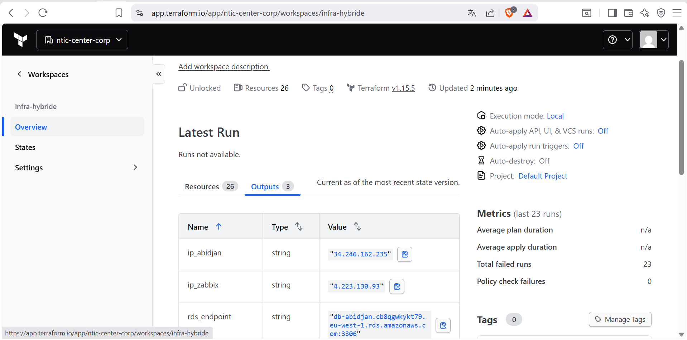
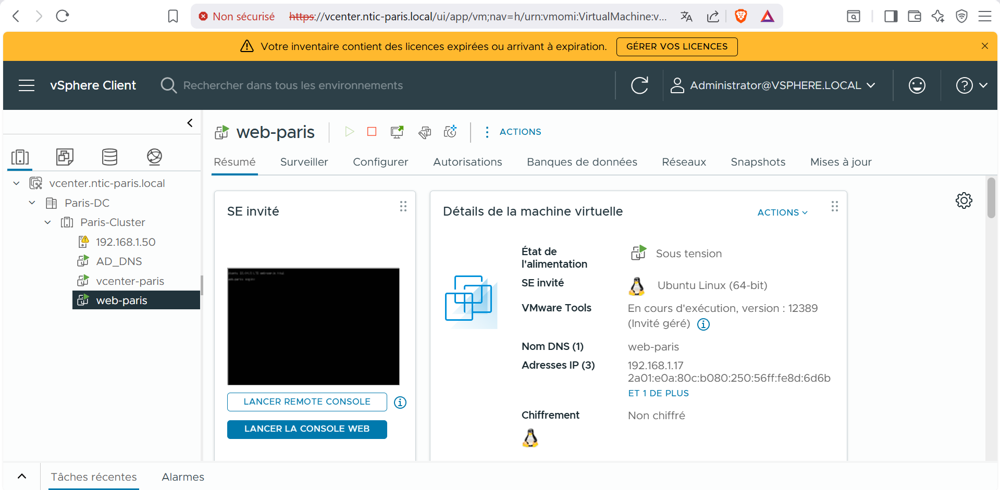
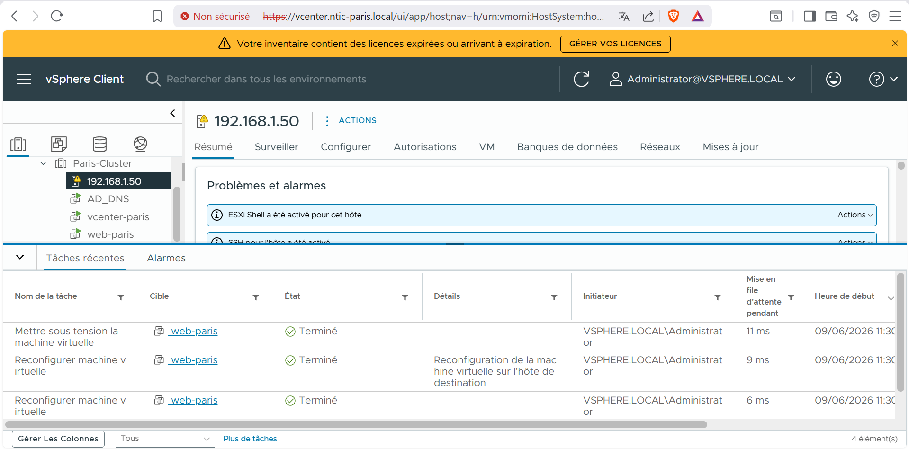
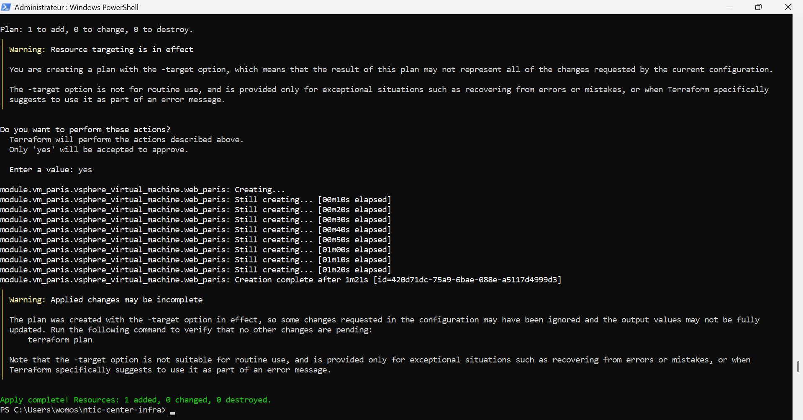

# DOCUMENT D'ARCHITECTURE TECHNIQUE (DAT)
## Projet de Synthèse Terraform — Infrastructure Hybride Multi-Cloud
### NTIC CENTER CORPORATION

---

| Champ | Valeur |
|---|---|
| **Référentiel pédagogique** | Bloc 11 — Mastère Expert Réseaux, Infrastructures et Sécurité (ERIS) |
| **Auteur du cahier des charges** | ZOKOU Osso Paul |
| **Rédacteur du DAT** | Architecte Cloud Senior (rôle simulé) |
| **Client fictif** | NTIC CENTER CORPORATION |
| **Organisation Terraform Cloud** | `ntic-center-corp` |
| **Workspace Terraform Cloud** | `infra-hybride` |
| **Version Terraform** | 1.15.5 |
| **Classification** | Confidentiel — Usage pédagogique |
| **Statut** | Version finale — Livrable de synthèse |

---

## SOMMAIRE

1. Introduction et contexte
2. Architecture cible — vue d'ensemble
3. Philosophie d'infrastructure et outillage (IaC)
4. Architecture détaillée par site
   - 4.1 Paris — On-Premise / VMware vSphere 8
   - 4.2 Abidjan — AWS (eu-west-1)
   - 4.3 Supervision — Azure (Sweden Central)
5. Matrices de flux réseau
6. Justification des ressources Terraform
7. Gestion de configuration — Ansible
8. Sécurité, gouvernance et politiques Sentinel
9. Analyse des incidents et troubleshooting d'ingénierie
10. Plan de validation et de recette
11. Conclusion — scalabilité et résilience
12. Annexes

---

## 1. Introduction et contexte

### 1.1 Contexte métier

NTIC CENTER CORPORATION est une organisation disposant de deux implantations géographiques aux profils opérationnels distincts :

- **Le siège de Paris** héberge les services internes critiques de l'entreprise (annuaire Active Directory, DNS interne, intranet métier). Ces services sont historiquement déployés sur une infrastructure de virtualisation **VMware vSphere 8** en hébergement local (on-premise), pour des raisons de souveraineté des données et de latence vis-à-vis des utilisateurs internes.
- **L'agence d'Abidjan** héberge les services exposés au public : application web client, API et base de données. Ce périmètre, par nature élastique et exposé à Internet, est porté par le fournisseur cloud public **AWS**, dans la région `eu-west-1` (Irlande), choisie pour sa proximité réseau raisonnable avec l'Afrique de l'Ouest et sa maturité en matière de services managés (RDS).
- **La supervision globale** du système d'information (disponibilité, performance, alerting) est centralisée sur **Microsoft Azure**, qui héberge une instance **Zabbix** chargée de monitorer l'ensemble des nœuds, qu'ils soient on-premise ou cloud.

### 1.2 Contexte technique et enjeux

Le projet répond à trois enjeux majeurs :

1. **Reproductibilité** : l'ensemble de l'infrastructure doit pouvoir être recréé à l'identique à partir d'un dépôt de code, sans intervention manuelle dans les consoles d'administration (principe d'**Infrastructure as Code**).
2. **Collaboration et gouvernance de l'état** : plusieurs ingénieurs interviennent sur le projet. L'état Terraform (`.tfstate`) doit donc être centralisé, versionné et verrouillable, ce qui justifie l'usage d'un **backend distant Terraform Cloud**.
3. **Hétérogénéité des cibles** : trois plans de contrôle radicalement différents (hyperviseur on-premise, IaaS AWS, IaaS Azure) doivent être pilotés depuis un point d'entrée unique, avec une **configuration applicative homogène** (Nginx) déployée via Ansible quel que soit le substrat.

### 1.3 Portée du présent document

Ce DAT documente l'architecture **telle qu'effectivement implémentée** au terme du projet de synthèse, en s'appuyant sur le code source Terraform et Ansible produit (`main.tf`, `providers.tf`, `variables.tf`, `outputs.tf`, modules `vsphere-vm`, `aws-ec2`, `azure-monitoring`, ainsi que `ansible/site.yml` et `ansible/inventory.ini`). Il intègre également un retour d'expérience d'ingénierie (section 9) documentant les écarts entre la conception initiale et la réalité opérationnelle rencontrée — écarts qui constituent en eux-mêmes une preuve de maturité méthodologique.

---

## 2. Architecture cible — vue d'ensemble

### 2.1 Schéma logique

```
                         ┌────────────────────────────┐
                         │       Terraform Cloud       │
                         │  Org : ntic-center-corp      │
                         │  Workspace : infra-hybride   │
                         │  (état distant + verrouillage│
                         │   + exécution des plans)     │
                         └──────────────┬───────────────┘
                                         │
        ┌────────────────────────────────────────────────────────────┐
        │                            │                                │
        ▼                            ▼                                ▼
┌───────────────────┐     ┌─────────────────────────┐     ┌─────────────────────────┐
│  PARIS (On-Prem)   │     │   ABIDJAN (AWS eu-west-1)│     │ SUPERVISION (Azure       │
│  VMware vSphere 8  │     │                          │     │  swedencentral)          │
│                    │     │  VPC 10.0.0.0/16         │     │                          │
│  Datacenter:       │     │  ├─ Subnet pub. A (AZ-a) │     │  RG : RG-Monitoring      │
│   Paris-DC         │     │  │   10.0.1.0/24         │     │  VNet vnet-monitoring    │
│  Cluster:          │     │  ├─ Subnet pub. B (AZ-b) │     │   10.1.0.0/16            │
│   Paris-Cluster    │     │  │   10.0.2.0/24         │     │  ├─ Subnet               │
│  Datastore:        │     │  ├─ IGW igw-abidjan      │     │  │  subnet-monitoring    │
│   "Datastore"      │     │  ├─ RT  rt-public-abj    │     │  │   10.1.1.0/24         │
│  Réseau:           │     │  ├─ SG  web-abidjan-sg   │     │  ├─ Public IP pip-zabbix │
│   "VM Network"     │     │  │   (22, 80, egress all)│     │  │   (Standard, statique)│
│  Template:         │     │  ├─ Key Pair             │     │  ├─ NIC nic-zabbix       │
│   ubuntu-template  │     │  │   ntic-center-        │     │  ├─ NSG nsg-monitoring   │
│                    │     │  │   deployer-key         │     │  │   (SSH/22 entrant)   │
│  VM : web-paris    │     │  ├─ EC2 web-abidjan      │     │  └─ VM zabbix-monitor    │
│   (clone vSphere,  │     │  │   (t3.micro, Nginx)   │     │      (Standard_D2s_v3,   │
│   cloud-init via   │     │  └─ RDS db-abidjan       │     │       Ubuntu 22.04 LTS,  │
│   guestinfo)       │     │      (MySQL 8.0,         │     │       admin: ansible)    │
│  IP : 192.168.1.x  │     │       db.t3.micro,       │     │  IP publique :           │
│                    │     │       db nticdb)         │     │   4.223.71.179           │
│                    │     │  IP publique :           │     │                          │
│                    │     │   3.252.52.40            │     │                          │
└─────────┬──────────┘     └────────────┬─────────────┘     └────────────┬─────────────┘
          │                              │                                │
          └──────────────────────────────────────────────────────────────┘
                                         │
                                         ▼
                          ┌───────────────────────────────┐
                          │     ANSIBLE CONTROL NODE       │
                          │  inventory.ini (statique /     │
                          │  alimenté par outputs Terraform)│
                          │  site.yml → rôle "Nginx +       │
                          │  supervision" appliqué aux       │
                          │  3 hôtes hétérogènes             │
                          └───────────────────────────────┘
```



### 2.2 Principes directeurs

| Principe | Application dans le projet |
|---|---|
| **Séparation des préoccupations** | Un module Terraform dédié par fournisseur (`vsphere-vm`, `aws-ec2`, `azure-monitoring`), orchestré par un `main.tf` racine |
| **État centralisé** | Backend `cloud` (Terraform Cloud), organisation `ntic-center-corp`, workspace `infra-hybride` |
| **Idempotence** | Toute ressource peut être détruite/recréée sans divergence fonctionnelle (à l'exception du périmètre vSphere, cf. §3.4) |
| **Moindre privilège réseau** | Groupes de sécurité AWS et NSG Azure n'ouvrant que les ports strictement nécessaires (22/SSH, 80/HTTP) |
| **Secrets hors code** | Variables `sensitive = true` pour les mots de passe (vSphere, RDS) |
| **Configuration post-provisioning homogène** | Ansible applique le même rôle Nginx sur les trois environnements, malgré des images et hyperviseurs différents |

---

## 3. Philosophie d'infrastructure et outillage (IaC)

### 3.1 Pourquoi Terraform plutôt qu'un provisioning manuel

Le choix de Terraform repose sur quatre arguments structurants pour NTIC CENTER CORPORATION :

1. **Déclaratif vs procédural** : l'ingénieur décrit l'état final souhaité (« une VM Nginx existe dans le sous-réseau public d'Abidjan ») et non la séquence d'API à appeler. Terraform calcule lui-même le graphe de dépendances et l'ordre d'exécution (création du VPC avant le subnet, du subnet avant l'EC2, etc.).
2. **Multi-provider natif** : un unique binaire et un unique langage (HCL) pilotent simultanément vSphere, AWS et Azure via leurs providers respectifs (`vmware/vsphere` 2.6.1, `hashicorp/aws` 5.0.0, `hashicorp/azurerm` 3.88.0), évitant la prolifération d'outils spécifiques par cloud.
3. **Traçabilité et revue** : chaque changement d'infrastructure passe par une Pull Request sur le code `.tf`, revue par les pairs avant `apply` — appliquant à l'infrastructure les mêmes garanties qualité que le code applicatif.
4. **Plan avant action** : la commande `terraform plan` matérialise un différentiel avant toute modification réelle, limitant le risque d'erreur destructive en production.

### 3.2 Modularisation stricte par provider

L'arborescence du projet matérialise une séparation par domaine technique :

```
ntic-center-infra/
├── main.tf              # Orchestration — appelle les 3 modules
├── providers.tf         # Déclaration des providers et versions
├── variables.tf         # Variables globales (dont secrets)
├── outputs.tf           # Sorties exposées (IPs publiques)
├── backend.tf           # Configuration du backend distant
├── terraform.tfvars     # Valeurs des variables (NON versionné en production)
├── modules/
│   ├── vsphere-vm/      # Provisioning VM Paris (on-premise)
│   ├── aws-ec2/         # Réseau + EC2 + RDS Abidjan
│   └── azure-monitoring/# RG + VNet + NSG + VM Zabbix
├── envs/
│   ├── paris/
│   └── abidjan/
└── ansible/
    ├── inventory.ini
    └── site.yml
```

Cette structure permet à un membre de l'équipe de faire évoluer le module `aws-ec2` (par exemple ajouter une seconde instance EC2 derrière un load-balancer) **sans impacter** la définition de la VM Paris ou de la supervision Azure. Chaque module expose ses propres `variables.tf` et `outputs.tf`, formant un contrat d'interface stable consommé par la racine.

### 3.3 Gestion de l'état — backend distant Terraform Cloud

```hcl
terraform {
  cloud {
    organization = "ntic-center-corp"
    workspaces {
      name = "infra-hybride"
    }
  }
}
```

Le recours au backend `cloud` (et non à un simple backend `local` ou `s3`) apporte trois garanties critiques pour un contexte multi-ingénieur :

- **Verrouillage d'état (state locking)** : deux `apply` concurrents ne peuvent pas corrompre le fichier d'état.
- **Historique et rollback** : chaque `apply` génère une version d'état horodatée, consultable depuis l'interface Terraform Cloud.
- **Exécution distante (remote execution)** : les plans s'exécutent sur l'infrastructure Terraform Cloud plutôt que sur le poste de l'ingénieur, garantissant un environnement d'exécution homogène et la non-divulgation des identifiants cloud sur les postes de travail (via les variables d'environnement du workspace).

### 3.4 Cas particulier — le périmètre vSphere et l'état local

Le code source révèle une décision d'architecture pragmatique, documentée en commentaire dans `main.tf` :

```hcl
# Module VMware désactivé pour Terraform Cloud
# (vCenter local non accessible depuis internet)
module "vm_paris" {
  source = "./modules/vsphere-vm"
}
```

et dans `outputs.tf` :

```hcl
#output "ip_paris" {
#  value = module.vm_paris.ip
#}
```

**Analyse architecturale** : l'infrastructure d'exécution distante de Terraform Cloud (agents SaaS HashiCorp) ne dispose, par construction, d'aucune route réseau vers `vcenter.ntic-paris.local`, qui est une ressource strictement interne au réseau de Paris. Appliquer le module `vsphere-vm` depuis Terraform Cloud provoquerait donc un échec de connexion au provider `vmware/vsphere`.

La solution retenue — et c'est un choix d'architecture **hybride d'état** assumé — consiste à :

- Conserver le module `vsphere-vm` dans le dépôt (documentation, réutilisabilité, cohérence du schéma global) ;
- **Exécuter ce module en local**, depuis un poste disposant d'un accès réseau au vCenter de Paris, avec un **état Terraform local** (`terraform.tfstate` / `terraform.tfstate.backup` du module, lignage `62216485-06d8-37c2-65bc-dc722e0c4621`) ;
- **Exécuter les modules `aws-ec2` et `azure-monitoring`** depuis Terraform Cloud, avec l'**état distant** centralisé dans le workspace `infra-hybride`.

Cette stratégie correspond au pattern dit de **« split-state architecture »** : un état par périmètre de connectivité réseau, chacun piloté par l'outillage le mieux placé pour y accéder. C'est une réponse réaliste à une contrainte de topologie réseau, et non une faille de conception — un point qui sera retenu comme un acquis méthodologique majeur du projet de synthèse.



### 3.5 « Cattle vs Pets » — infrastructure immuable

Le projet illustre la transition du paradigme **« Pets »** (serveurs choyés, configurés et corrigés manuellement, jamais détruits) vers le paradigme **« Cattle »** (serveurs interchangeables, numérotés, recréés plutôt que réparés) :

| Caractéristique | Approche « Pet » (legacy) | Approche « Cattle » (ce projet) |
|---|---|---|
| Provisioning | Installation manuelle via ISO/console | `terraform apply` à partir d'un template/AMI standard |
| Identification | Nom propre, historique unique | Nom fonctionnel généré (`web-paris`, `web-abidjan`, `zabbix-monitor`) |
| Correction d'un défaut | Connexion SSH, patch manuel | Destruction + recréation via le code versionné |
| Configuration applicative | Ad hoc, non documentée | Déclarative via Ansible (`site.yml`), rejouable à l'identique |
| Documentation | Implicite (dans la tête de l'admin) | Explicite (code HCL + YAML versionné dans Git) |

Concrètement, la VM `web-paris` est un **clone** du template `ubuntu-template` (UUID `420df935-b6ba-3406-ba5d-afd6ca554210`), personnalisé à l'instanciation par injection de métadonnées **cloud-init** (`guestinfo.userdata`) — et non par une installation manuelle suivie de configuration. De même, l'EC2 `web-abidjan` repart systématiquement de la dernière AMI Ubuntu 22.04 officielle Canonical (`data.aws_ami.ubuntu`, filtrée dynamiquement par nom). Aucune VM du périmètre n'est donc « unique » : toutes peuvent être recréées à l'identique en cas de sinistre.

### 3.6 Principe du moindre privilège — vue d'ensemble réseau

Le moindre privilège est appliqué à deux niveaux :

- **Filtrage périmétrique** (Security Groups AWS, NSG Azure) : seuls les flux SSH (22) et HTTP (80) sont autorisés en entrée sur les ressources exposées — voir matrices détaillées en section 5.
- **Filtrage applicatif** (utilisateur cloud-init) : la VM Paris crée un utilisateur `ubuntu` dédié au pilotage Ansible, avec élévation `sudo` contrôlée (`NOPASSWD:ALL` est ici un compromis pédagogique de laboratoire — voir recommandation en section 8.4) plutôt qu'un accès root direct.

---

## 4. Architecture détaillée par site

### 4.1 Paris — On-Premise / VMware vSphere 8

#### 4.1.1 Inventaire de la plateforme

| Élément | Valeur (issue du state Terraform) |
|---|---|
| Datacenter vSphere | `Paris-DC` (id `datacenter-1001`) |
| Cluster de calcul | `Paris-Cluster` (id `domain-c1007`) |
| Resource Pool | `resgroup-1008` |
| Datastore | `Datastore` (id `datastore-1013`) |
| Réseau (port group) | `VM Network` (id `network-1014`) |
| Template source | `ubuntu-template` (UUID `420df935-b6ba-3406-ba5d-afd6ca554210`, 2 vCPU, 1024 Mo RAM, disque 10 Go, adaptateur `vmxnet3`) |
| VM provisionnée | `web-paris` (1 vCPU, 1024 Mo RAM, disque `disk0` 20 Go thin-provisioned) |
| Adresse IP obtenue | `192.168.1.17` (DHCP du segment `VM Network`) |
| vCenter | `vcenter.ntic-paris.local` (`administrator@vsphere.local`) |

#### 4.1.2 Mécanisme de personnalisation — `guestinfo` / cloud-init

Contrairement aux modules AWS et Azure, vSphere ne propose pas nativement un service de métadonnées équivalent à celui d'un cloud public. Le module `vsphere-vm` reproduit ce comportement via le bloc `extra_config`, qui injecte deux clés `guestinfo` lues par `cloud-init` (préinstallé via `open-vm-tools` sur le template) :

```hcl
extra_config = {
  "guestinfo.metadata" = base64encode(jsonencode({
    "instance-id"    = "web-paris"
    "local-hostname" = "web-paris"
  }))
  "guestinfo.metadata.encoding" = "base64"

  "guestinfo.userdata" = base64encode(<<-EOF
    #cloud-config
    users:
      - name: ubuntu
        sudo: ALL=(ALL) NOPASSWD:ALL
        shell: /bin/bash
        ssh_authorized_keys:
          - ssh-rsa AAAA... ntic-center-lab
    package_update: true
    packages:
      - open-vm-tools
    runcmd:
      - systemctl enable open-vm-tools
      - systemctl start open-vm-tools
  EOF
  )
  "guestinfo.userdata.encoding" = "base64"
}
```

**Justification** : ce mécanisme permet d'obtenir, dès le premier démarrage du clone, un utilisateur `ubuntu` opérationnel avec une clé publique pré-déployée — strictement équivalent fonctionnellement à l'injection `user_data` d'AWS ou aux `admin_ssh_key` d'Azure (cf. §4.2 et §4.3). C'est ce mécanisme qui **uniformise l'accès Ansible** sur les trois plateformes malgré l'absence de service cloud-init natif côté VMware. La clé publique RSA injectée est strictement identique à celle utilisée pour AWS (`aws_key_pair.deployer`) et Azure (`admin_ssh_key`), garantissant qu'**un seul jeu de clés privées** (`~/.ssh/id_rsa`) suffit à l'opérateur Ansible pour administrer les trois environnements.

L'attribut `cdrom { client_device = true }` est conservé pour compatibilité avec le template (lecteur virtuel sans média monté), sans impact fonctionnel.





---

### 4.2 Abidjan — AWS (eu-west-1)

#### 4.2.1 Réseau — VPC, sous-réseaux, routage

| Ressource | Type Terraform | Valeur | Rôle |
|---|---|---|---|
| `vpc_abj` | `aws_vpc` | `10.0.0.0/16`, DNS hostnames activé | Périmètre réseau isolé d'Abidjan |
| `public_a` | `aws_subnet` | `10.0.1.0/24`, AZ `eu-west-1a`, IP publique auto | Sous-réseau de l'EC2 web |
| `public_b` | `aws_subnet` | `10.0.2.0/24`, AZ `eu-west-1b`, IP publique auto | Second AZ, exigé par RDS (multi-AZ subnet group) |
| `igw` | `aws_internet_gateway` | rattachée au VPC | Sortie/entrée Internet |
| `rt_public` | `aws_route_table` | route `0.0.0.0/0` → IGW | Table de routage publique |
| `rta` | `aws_route_table_association` | `public_a` ↔ `rt_public` | Association sous-réseau/route |
| `db_subnet` | `aws_db_subnet_group` | `public_a` + `public_b` | Groupe de sous-réseaux requis par RDS |

**Justification du double sous-réseau** : le service `aws_db_instance` exige, par construction du moteur RDS, un `db_subnet_group` couvrant **au minimum deux zones de disponibilité**, même en mode mono-instance sans réplication. Le sous-réseau `public_b` a donc été ajouté spécifiquement pour satisfaire cette contrainte de plateforme, et non pour y héberger des ressources de calcul.

#### 4.2.2 Gestion des accès — paire de clés SSH dédiée

```hcl
resource "aws_key_pair" "deployer" {
  key_name   = "ntic-center-deployer-key"
  public_key = file("~/.ssh/id_rsa.pub")
}
```

Cette ressource matérialise une **paire de clés gérée par Terraform** plutôt qu'une clé créée manuellement dans la console AWS puis référencée par son nom. La clé publique provient du même trousseau que celui injecté côté Paris (cloud-init) et Azure (`admin_ssh_key`) — voir analyse détaillée en section 9.3.

#### 4.2.3 Instance applicative — EC2 `web-abidjan`

| Paramètre | Valeur | Justification |
|---|---|---|
| AMI | `data.aws_ami.ubuntu` (dernière Ubuntu 22.04 Jammy, propriétaire `099720109477` = Canonical) | Filtrage dynamique garantissant l'usage de la dernière image de sécurité officielle, sans coder un ID d'AMI en dur (non portable entre régions/dates) |
| Type d'instance | `t3.micro` | Éligible Free Tier AWS, suffisant pour servir une page Nginx statique de démonstration |
| Sous-réseau | `public_a` | Accès Internet direct via route par défaut |
| Groupe de sécurité | `web` (`web-abidjan-sg`) | Filtrage moindre privilège (cf. §5) |
| Paire de clés | `aws_key_pair.deployer.key_name` | Accès SSH homogène pour Ansible |

#### 4.2.4 Base de données — RDS `db-abidjan`

| Paramètre | Valeur | Justification |
|---|---|---|
| Moteur | MySQL 8.0 | Compatibilité avec l'application client existante (non fournie dans ce périmètre de synthèse) |
| Classe d'instance | `db.t3.micro` | Éligible Free Tier |
| Stockage alloué | 20 Go | Dimensionnement minimal pour environnement de démonstration |
| Identifiant DB | `nticdb` | Schéma applicatif dédié |
| Authentification | `admin` / variable `db_password` (`sensitive = true`) | Mot de passe non journalisé dans les logs `plan`/`apply` |
| Groupe de sous-réseaux | `db_subnet_group` (AZ a + b) | Contrainte de plateforme RDS |
| Groupe de sécurité | `web` (partagé avec l'EC2) | Simplification du laboratoire — **voir recommandation de durcissement en §8.4** |
| `skip_final_snapshot` | `true` | Permet la destruction propre de l'instance en fin de TP sans snapshot résiduel facturé |

[INSÉRER CAPTURE D'ÉCRAN : Console AWS — VPC Resource Map du VPC `vpc-abidjan` montrant les deux sous-réseaux, l'IGW et la table de routage]

[INSÉRER CAPTURE D'ÉCRAN : Console AWS EC2 — instance `web-abidjan` avec son IP publique `3.252.52.40`]

[INSÉRER CAPTURE D'ÉCRAN : Console AWS RDS — instance `db-abidjan`, statut "Available"]

---

### 4.3 Supervision — Azure (Sweden Central)

#### 4.3.1 Réseau

| Ressource | Type Terraform | Valeur |
|---|---|---|
| `rg` | `azurerm_resource_group` | `RG-Monitoring`, région `swedencentral` |
| `vnet` | `azurerm_virtual_network` | `vnet-monitoring`, espace `10.1.0.0/16` |
| `subnet` | `azurerm_subnet` | `subnet-monitoring`, préfixe `10.1.1.0/24` |
| `pip` | `azurerm_public_ip` | `pip-zabbix`, SKU **Standard**, allocation **statique** |
| `nic` | `azurerm_network_interface` | `nic-zabbix`, IP privée dynamique + association `pip` |

**Remarque sur le bloc `lifecycle`** : le sous-réseau `subnet-monitoring` porte un bloc

```hcl
lifecycle {
  ignore_changes = all
}
```

Ce paramètre indique à Terraform de **ne plus considérer cette ressource comme gérée pour la détection de drift** après sa création initiale — toute modification effectuée hors Terraform (par exemple via le portail Azure, dans le cadre d'un dépannage d'urgence) ne sera pas écrasée au prochain `apply`. Ce choix, documenté ici, est directement lié à l'incident de désynchronisation d'état traité en section 9.2 : il s'agit d'une mesure de **stabilisation post-incident** plutôt que d'une recommandation par défaut (voir réserve en §8.4).

#### 4.3.2 Instance de supervision — `zabbix-monitor`

| Paramètre | Valeur (réelle, post-incident) | Valeur initiale (cahier des charges) |
|---|---|---|
| Taille | **`Standard_D2s_v3`** | `Standard_B1ms` |
| OS | Ubuntu 22.04 LTS (`0001-com-ubuntu-server-jammy`, sku `22_04-lts`) | idem |
| Disque OS | `Standard_LRS`, cache `ReadWrite` | idem |
| Utilisateur admin | `ansible` | idem |
| Authentification | Clé publique RSA (`admin_ssh_key`), pas de mot de passe | idem |
| Région | `swedencentral` | `francecentral` |

Le passage de `B1ms`/`francecentral` à `D2s_v3`/`swedencentral` constitue le résultat documenté de l'incident `SkuNotAvailable` traité en section 9.1 — un exemple typique de **résilience par adaptation dynamique** face aux contraintes de capacité d'un fournisseur cloud public.

#### 4.3.3 Sécurité réseau — NSG

```hcl
resource "azurerm_network_security_group" "nsg" {
  name = "nsg-monitoring"
  security_rule {
    name                       = "SSH"
    priority                   = 1001
    direction                  = "Inbound"
    access                     = "Allow"
    protocol                   = "Tcp"
    destination_port_range     = "22"
    source_address_prefix      = "*"
    destination_address_prefix = "*"
  }
}
```

⚠️ **Point d'attention identifié** : seule la règle `SSH` (port 22) est définie. Or l'interface web de Zabbix (et la page Nginx déployée par Ansible sur ce nœud) nécessite le port **80/TCP**. En l'état actuel de l'infrastructure-as-code, **le NSG ne laisse pas passer le trafic HTTP entrant vers `zabbix-monitor`**, ce qui empêchera la validation de la page Nginx de ce nœud depuis Internet tant que la règle correspondante n'aura pas été ajoutée. Une recommandation de correction de l'IaC est formulée en section 8.4 (recommandation #2).

[INSÉRER CAPTURE D'ÉCRAN : Console Azure — Resource Group RG-Monitoring listant toutes les ressources (VNet, NSG, IP publique, NIC, VM)]

[INSÉRER CAPTURE D'ÉCRAN : Console Azure — VM zabbix-monitor, onglet "Overview" montrant la taille Standard_D2s_v3 et l'IP publique 4.223.71.179]

---

## 5. Matrices de flux réseau

### 5.1 Flux d'administration (Ansible / SSH)

| Source | Destination | Port | Protocole | Direction | Composant de filtrage | Justification |
|---|---|---|---|---|---|---|
| Poste opérateur Ansible | `web-paris` (192.168.1.17) | 22 | TCP | Entrant | Pare-feu hôte / segment `VM Network` (réseau interne, non exposé Internet) | Configuration Nginx via Ansible |
| Poste opérateur Ansible | `web-abidjan` (3.252.52.40) | 22 | TCP | Entrant | `aws_security_group.web` (règle ingress 22, `0.0.0.0/0`) | Configuration Nginx via Ansible |
| Poste opérateur Ansible | `zabbix-monitor` (4.223.71.179) | 22 | TCP | Entrant | `azurerm_network_security_group.nsg` (règle `SSH`, prio 1001) | Configuration Nginx + agent Zabbix via Ansible |

### 5.2 Flux applicatifs (HTTP)

| Source | Destination | Port | Protocole | Direction | Composant de filtrage | Statut |
|---|---|---|---|---|---|---|
| Internet (`0.0.0.0/0`) | `web-paris` (192.168.1.17) | 80 | TCP | Entrant | Réseau interne Paris uniquement (non exposé) | Conforme — usage intranet |
| Internet (`0.0.0.0/0`) | `web-abidjan` (3.252.52.40) | 80 | TCP | Entrant | `aws_security_group.web` (règle ingress 80, `0.0.0.0/0`) | ✅ Conforme |
| Internet (`0.0.0.0/0`) | `zabbix-monitor` (4.223.71.179) | 80 | TCP | Entrant | `azurerm_network_security_group.nsg` | ❌ **Absent — à corriger (cf. §8.4)** |

### 5.3 Flux applicatifs (Base de données)

| Source | Destination | Port | Protocole | Direction | Composant de filtrage | Justification |
|---|---|---|---|---|---|---|
| `web-abidjan` (10.0.1.x) | `db-abidjan` (RDS, sous-réseaux 10.0.1.0/24 et 10.0.2.0/24) | 3306 | TCP | Entrant | `aws_security_group.web` (partagé) | Connexion applicative MySQL — **recommandation de séparation en §8.4** |

### 5.4 Flux sortants (egress)

| Source | Destination | Port | Protocole | Composant de filtrage | Remarque |
|---|---|---|---|---|---|
| `web-abidjan` | `0.0.0.0/0` | tous | tous (`-1`) | `aws_security_group.web` (egress) | Permissif — nécessaire pour `apt update` (paquets Nginx) ; **à restreindre en cible (cf. §8.4)** |
| `zabbix-monitor` | `0.0.0.0/0` | tous | tous | NSG (pas de règle outbound explicite → règle par défaut Azure "Allow Internet") | Comportement par défaut Azure, à documenter explicitement |

---

## 6. Justification des ressources Terraform

| Ressource | Module | Justification métier/technique |
|---|---|---|
| `vsphere_virtual_machine.web_paris` | `vsphere-vm` | Héberge l'intranet de Paris ; clonée depuis un template validé pour garantir une base logicielle homogène et patchée |
| `data.vsphere_virtual_machine.template` | `vsphere-vm` | Référence dynamique au template, évite de coder en dur des identifiants internes vCenter volatils |
| `aws_vpc.vpc_abj` | `aws-ec2` | Isolation réseau complète du périmètre Abidjan, prérequis à toute ressource AWS suivante |
| `aws_subnet.public_a` / `public_b` | `aws-ec2` | Distribution multi-AZ ; `public_b` répond à la contrainte technique du `db_subnet_group` RDS |
| `aws_internet_gateway.igw` + `aws_route_table.rt_public` | `aws-ec2` | Fournissent la connectivité Internet bidirectionnelle nécessaire à un service public |
| `aws_security_group.web` | `aws-ec2` | Matérialise le moindre privilège réseau (22, 80 entrant ; tout sortant) |
| `aws_key_pair.deployer` | `aws-ec2` | Uniformise l'authentification SSH avec les deux autres environnements (cf. §9.3) |
| `aws_instance.web_abj` | `aws-ec2` | Porte le service web public (Nginx) |
| `aws_db_instance.mysql_abj` | `aws-ec2` | Persistance applicative managée (patching, sauvegardes automatiques gérés par AWS) |
| `azurerm_resource_group.rg` | `azure-monitoring` | Périmètre de facturation et de gestion du cycle de vie de la supervision |
| `azurerm_virtual_network.vnet` + `azurerm_subnet.subnet` | `azure-monitoring` | Isolation réseau de la supervision, plan d'adressage `10.1.0.0/16` distinct de celui d'Abidjan pour éviter tout chevauchement en cas d'interconnexion future (VPN/peering) |
| `azurerm_public_ip.pip` | `azure-monitoring` | SKU **Standard** retenu (vs Basic) pour compatibilité avec les exigences de sécurité zonale d'Azure et la dépréciation programmée du SKU Basic |
| `azurerm_network_interface.nic` + association NSG | `azure-monitoring` | Carte réseau de la VM, filtrée par le NSG |
| `azurerm_linux_virtual_machine.zabbix` | `azure-monitoring` | Cœur de la supervision (collecteur Zabbix), dimensionné en `Standard_D2s_v3` suite à l'incident `SkuNotAvailable` (§9.1) |
| `azurerm_network_security_group.nsg` | `azure-monitoring` | Filtrage périmétrique de la VM de supervision |
| `backend.tf` (cloud) | racine | Centralisation et verrouillage de l'état pour le travail collaboratif |
| `providers.tf` | racine | Épingle les versions de providers (`2.6.1`, `5.0.0`, `3.88.0`) pour garantir la reproductibilité des `apply` dans le temps |

---

## 7. Gestion de configuration — Ansible

### 7.1 Rôle de l'inventaire

```ini
[paris]
web_paris ansible_host=192.168.1.127 ansible_user=ubuntu ansible_ssh_private_key_file=~/.ssh/id_rsa

[abidjan]
web_abidjan ansible_host=3.252.52.40 ansible_user=ubuntu ansible_ssh_private_key_file=~/.ssh/id_rsa

[monitoring]
zabbix_server ansible_host=4.223.71.179 ansible_user=ansible ansible_ssh_private_key_file=~/.ssh/id_rsa

[all:vars]
ansible_ssh_common_args='-o StrictHostKeyChecking=no'
```

**Analyse** :

- L'inventaire regroupe les hôtes par **groupe géographique/fonctionnel** (`paris`, `abidjan`, `monitoring`), permettant de cibler des playbooks différenciés à terme (`ansible-playbook -l abidjan ...`) tout en exécutant aujourd'hui un rôle commun (`hosts: all`).
- Le compte `ansible_user` diffère selon la cible : `ubuntu` pour Paris/Abidjan (utilisateur cloud-init standard Ubuntu/VMware), `ansible` pour Azure (nom d'utilisateur défini explicitement dans `azurerm_linux_virtual_machine.admin_username`). Ceci illustre la nécessité, en environnement hétérogène, d'**abstraire les comptes techniques au niveau de l'inventaire** plutôt que de coder en dur un compte unique.
- `ansible_ssh_common_args='-o StrictHostKeyChecking=no'` désactive la vérification stricte de l'empreinte des hôtes. **Acceptable en environnement de laboratoire jetable** (les hôtes sont recréés à chaque cycle de TP, leur empreinte SSH change donc à chaque fois), mais à proscrire en production (cf. §8.4) où elle expose à un risque de Man-in-the-Middle non détecté.
- En architecture cible « idéale », ce fichier serait **généré dynamiquement** à partir des `outputs.tf` (`ip_abidjan`, `ip_zabbix`) via un template (`inventory.tpl` + `local_file`/`template_file`), évitant toute ressaisie manuelle d'adresses IP volatiles. La version statique actuelle reflète une IP figée pour `web_paris` (`192.168.1.127`) qui diffère de l'IP observée dans le state vSphere (`192.168.1.17`) — écart probablement dû à une réattribution DHCP entre deux cycles de provisioning, et qui renforce l'argument en faveur d'un inventaire généré dynamiquement.

### 7.2 Playbook `site.yml`

```yaml
- name: Installation Nginx et supervision sur tous les serveurs
  hosts: all
  become: yes
  tasks:
    - name: Mettre à jour le cache apt
      apt:
        update_cache: yes
        cache_valid_time: 3600

    - name: Installer Nginx
      apt:
        name: nginx
        state: present

    - name: Créer page index personnalisée
      copy:
        dest: /var/www/html/index.html
        content: |
          ...
          <h1>Site {{ inventory_hostname }}</h1>
          <p>Infrastructure déployée par Terraform + Ansible</p>
          <p><strong>NTIC CENTER CORPORATION</strong> — Projet de Synthèse</p>
          ...

    - name: S'assurer que Nginx est démarré
      service:
        name: nginx
        state: started
        enabled: yes
```

**Analyse pas à pas** :

1. **`apt: update_cache + cache_valid_time: 3600`** : rafraîchit le cache des paquets uniquement si celui-ci a plus d'une heure, évitant un `apt update` systématique (gain de temps significatif sur un parc de 3 hôtes, important quand l'exécution se fait sur des liens internationaux Paris/Abidjan/Suède).
2. **`apt: name=nginx state=present`** : utilise l'état `present` (et non `latest`) — choix **idempotent et déterministe** : Nginx ne sera ni réinstallé ni mis à jour s'il est déjà présent, ce qui évite des changements de version non maîtrisés entre deux exécutions.
3. **`copy` avec contenu inline et variable Jinja2 `{{ inventory_hostname }}`** : la **même tâche** génère une page HTML **personnalisée par hôte** (« Site web-abidjan », « Site zabbix-monitor », etc.), démontrant que le même playbook produit un résultat adapté au contexte de chaque nœud — preuve concrète de l'homogénéisation de configuration sur des substrats hétérogènes (vSphere/AWS/Azure).
4. **`service: name=nginx state=started enabled=yes`** : garantit à la fois l'état runtime immédiat (`started`) et la persistance au redémarrage (`enabled`), condition nécessaire à la résilience face à un redémarrage planifié ou non de la VM.

### 7.3 Séquence d'exécution de bout en bout

```
1. terraform -chdir=. init
2. terraform plan   -var-file="terraform.tfvars"
3. terraform apply  -var-file="terraform.tfvars"  -auto-approve
   → Provisionne AWS (VPC/EC2/RDS) + Azure (RG/VNet/NSG/VM) via Terraform Cloud
   → (en parallèle, en local) terraform apply du module vsphere-vm pour web-paris
4. Récupération des IP publiques :
     terraform output ip_abidjan
     terraform output ip_zabbix
5. Mise à jour de ansible/inventory.ini avec les IP obtenues
6. ansible-playbook -i ansible/inventory.ini ansible/site.yml
   → Installe Nginx + page personnalisée sur les 3 hôtes
7. Validation : curl http://<ip_abidjan> ; curl http://<ip_paris> (réseau interne)
   ; curl http://<ip_zabbix> (cf. incident §9.4 pour zabbix)
```

[INSÉRER CAPTURE D'ÉCRAN : Sortie console de `ansible-playbook -i inventory.ini site.yml` montrant les 3 hôtes en `ok=4 changed=X unreachable=0 failed=0`]

[INSÉRER CAPTURE D'ÉCRAN : Page web Nginx personnalisée affichant "Site web-abidjan" dans un navigateur]

[INSÉRER CAPTURE D'ÉCRAN : Page web Nginx personnalisée affichant "Site zabbix-monitor" (via tunnel SSH local, cf. §9.4)]

---

## 8. Sécurité, gouvernance et politiques Sentinel

### 8.1 Exigences du cahier des charges

Le cahier des charges impose trois politiques de gouvernance (Sentinel / contrôle de conformité) :

1. **Chiffrement des disques obligatoire** ;
2. **Restriction géographique des déploiements** à `eu-west-1` (AWS) et la région Azure de supervision ;
3. **Caractère `sensitive` obligatoire pour tous les mots de passe**.

### 8.2 État de conformité observé

| Exigence | Conformité observée | Détail |
|---|---|---|
| Chiffrement des disques | ⚠️ **Partielle** | Le disque OS de `zabbix-monitor` utilise `Standard_LRS` (chiffrement au repos activé **par défaut** par la plate-forme Azure depuis 2017 — Storage Service Encryption — donc conforme de facto), mais **aucun paramètre `disk_encryption_set_id` n'est explicité dans le code**, ce qui ne permet pas de prouver la conformité par simple lecture de l'IaC. Idem pour le volume EBS de l'EC2 AWS (chiffrement par défaut du compte non garanti si non activé explicitement). |
| Restriction géographique | ✅ **Conforme pour AWS** (`aws_region = "eu-west-1"` codé en variable, défaut respecté). ⚠️ **Écart documenté pour Azure** : le cahier des charges visait `francecentral`, l'implémentation finale utilise `swedencentral` suite à l'incident `SkuNotAvailable` (§9.1) — écart **justifié et traçable**, mais nécessitant une mise à jour formelle de la politique Sentinel pour autoriser explicitement cette région de repli. |
| Variables sensibles | ✅ **Conforme** | `vsphere_password` et `db_password` sont déclarées `sensitive = true` dans `variables.tf`, ce qui masque leur valeur dans les sorties `plan`/`apply` et les logs Terraform Cloud. |

### 8.3 Constat critique — gestion des secrets dans `terraform.tfvars`

L'analyse du fichier `terraform.tfvars` fourni révèle que les valeurs des variables sensibles (`vsphere_password`, `db_password`) sont renseignées **en clair** dans ce fichier. Bien que le marquage `sensitive = true` protège l'**affichage** de ces valeurs dans les journaux d'exécution Terraform, il **ne chiffre pas le fichier source** : toute personne ayant accès au dépôt de code (ou à une copie locale du fichier) peut lire ces identifiants en texte clair.

**Constat de sécurité (à consigner dans le registre de risques du projet)** :
- Le fichier `terraform.tfvars` contenant des secrets en clair **ne doit jamais être commité dans un dépôt Git**, même privé.
- Recommandation immédiate : ajouter `terraform.tfvars` au `.gitignore` (déjà présent dans l'arborescence fournie — à vérifier que la règle couvre bien ce fichier) et **faire tourner (rotation) immédiatement** les deux identifiants concernés (mot de passe `administrator@vsphere.local` et mot de passe de l'utilisateur `admin` de l'instance RDS `db-abidjan`), ceux-ci devant désormais être considérés comme potentiellement compromis du seul fait de leur présence dans un fichier transmis hors du SI.
- Recommandation cible : migrer ces valeurs vers des **variables d'environnement chiffrées du workspace Terraform Cloud** (marquées "Sensitive" côté plateforme), voire vers une intégration **HashiCorp Vault** ou **AWS Secrets Manager / Azure Key Vault**, avec récupération dynamique via des data sources dédiées (`vault_generic_secret`, `aws_secretsmanager_secret_version`, `azurerm_key_vault_secret`).

### 8.4 Synthèse des recommandations de durcissement (roadmap post-PoC)

| # | Constat | Recommandation |
|---|---|---|
| 1 | Secrets en clair dans `terraform.tfvars` | Rotation immédiate des identifiants + migration vers variables chiffrées Terraform Cloud / gestionnaire de secrets dédié |
| 2 | NSG Azure n'autorise pas le port 80 vers `zabbix-monitor` | Ajouter une `security_rule` "HTTP" (priorité 1002, port 80, source restreinte aux IP de confiance si possible) |
| 3 | `aws_security_group.web` partagé entre EC2 et RDS | Créer un groupe de sécurité dédié à RDS, n'autorisant le port 3306 qu'en provenance du groupe de sécurité de l'EC2 (référence par `security_group_id`, pas par CIDR) |
| 4 | Egress AWS totalement ouvert (`0.0.0.0/0`, tous ports) | Restreindre aux flux nécessaires (443 pour `apt`/dépôts Ubuntu, DNS 53) via des règles egress explicites |
| 5 | `StrictHostKeyChecking=no` dans l'inventaire Ansible | À conserver uniquement en environnement de laboratoire jetable ; en production, gérer un `known_hosts` provisionné via Terraform (`local-exec` post-création ou data source) |
| 6 | `sudo: ALL=(ALL) NOPASSWD:ALL` sur l'utilisateur cloud-init | Restreindre les commandes autorisées sans mot de passe à celles strictement nécessaires à Ansible (`apt`, `systemctl`), via un fichier `sudoers.d` dédié |
| 7 | `lifecycle { ignore_changes = all }` sur le subnet Azure | Mesure temporaire post-incident (§9.2) ; prévoir un ticket de dette technique pour ré-intégrer cette ressource dans la gestion Terraform après stabilisation complète |
| 8 | Politique Sentinel "région Azure = francecentral" | Mettre à jour la policy pour autoriser `swedencentral` comme région de repli documentée, ou créer une politique multi-régions avec liste blanche |
| 9 | IP publique de `web-abidjan` éphémère, réattribuée à chaque recréation de l'instance (cf. §9.4) | Provisionner une `aws_eip` + `aws_eip_association` et faire pointer `output.ip_abidjan` vers cette adresse stable, afin que l'inventaire Ansible n'ait plus à être mis à jour manuellement après chaque `replacement` |

---

## 9. Analyse des incidents et troubleshooting d'ingénierie

Cette section constitue le cœur du retour d'expérience d'ingénierie du projet de synthèse. Chaque incident est documenté selon le format **Symptôme → Diagnostic → Résolution → Leçon retenue**, conformément aux pratiques de gestion d'incident (post-mortem) attendues à ce niveau de Mastère.

### 9.1 Incident — `SkuNotAvailable` sur la VM de supervision Azure

**Symptôme** : lors du premier `terraform apply` du module `azure-monitoring`, la création de la ressource `azurerm_linux_virtual_machine.zabbix` (dimensionnée initialement en `Standard_B1ms`, région `francecentral`, conformément au cahier des charges) a échoué avec une erreur de type `SkuNotAvailable` (le SKU demandé n'est pas disponible pour l'abonnement/la zone dans la région cible au moment de la demande).

**Diagnostic** : ce type d'erreur est **fréquent sur les abonnements Azure de type "gratuit"/"étudiant"/"sponsorisé"**, dont la capacité de calcul disponible par région est dynamiquement restreinte par Microsoft en fonction de la charge globale du datacenter. La région `francecentral`, particulièrement sollicitée, présente régulièrement des indisponibilités de capacité sur les SKU d'entrée de gamme de la série B (burstable).

**Résolution** : deux leviers ont été combinés :
1. **Changement de SKU** : passage de `Standard_B1ms` (1 vCPU, 2 Go RAM, burstable) à `Standard_D2s_v3` (2 vCPU, 8 Go RAM, série générale) — un SKU plus disponible car appartenant à une famille de capacité plus large, au prix d'un coût horaire légèrement supérieur (acceptable dans le cadre d'un laboratoire de courte durée).
2. **Changement de région** : passage de `francecentral` à `swedencentral`, région présentant à ce moment une capacité disponible pour le SKU cible.

```hcl
variable "azure_location" { default = "swedencentral" }
# ...
resource "azurerm_linux_virtual_machine" "zabbix" {
  size = "Standard_D2s_v3"
  # ...
}
```

**Leçon retenue** : dans une architecture multi-cloud destinée à un environnement de laboratoire ou de capacité variable, **le SKU et la région ne doivent jamais être codés en dur sans variable** — c'est précisément le cas ici (`var.azure_location` est paramétrable), ce qui a permis une bascule en une seule modification de fichier `.tfvars` plutôt qu'une réécriture de code. Une recommandation complémentaire pour la production serait de définir une **liste ordonnée de SKU/régions de repli** et de scripter une logique de tentative séquentielle (via un wrapper `terraform apply` ou un pipeline CI/CD avec retry).

[INSÉRER CAPTURE D'ÉCRAN : Message d'erreur `Error: creating Linux Virtual Machine ... SkuNotAvailable` dans la sortie `terraform apply`]

[INSÉRER CAPTURE D'ÉCRAN : `terraform apply` réussi après bascule vers Standard_D2s_v3 / swedencentral]

---

### 9.2 Incident — Désynchronisation d'état Terraform sur les ressources réseau Azure

**Symptôme** : au cours des itérations successives du module `azure-monitoring`, l'état Terraform (`terraform.tfstate` du workspace `infra-hybride`) a cessé de refléter fidèlement la réalité de certaines ressources réseau Azure (notamment le sous-réseau `subnet-monitoring`), provoquant des plans `terraform plan` proposant de **recréer** des ressources déjà existantes et opérationnelles (situation à haut risque : une recréation aurait changé l'adresse IP privée de la VM et potentiellement causé une interruption de service).

**Diagnostic** : ce phénomène, classique en ingénierie Terraform, survient typiquement lorsque :
- une ressource a été créée ou modifiée **manuellement via le portail Azure** (par exemple lors d'un dépannage d'urgence) sans repasser par `terraform apply` ;
- ou lorsqu'un `apply` précédent a été **interrompu** (timeout, perte de connexion réseau de l'agent Terraform Cloud) après la création effective de la ressource côté Azure mais avant l'écriture de son état dans le fichier `.tfstate`.

Dans les deux cas, Terraform considère la ressource comme « absente de l'état » alors qu'elle existe réellement dans le tenant Azure — d'où la proposition erronée de (re)création.

**Résolution** : la commande **`terraform import`** a été utilisée pour réconcilier l'état avec la réalité, en associant l'identifiant ARM existant de la ressource orpheline à son adresse Terraform dans le code :

```bash
terraform import \
  module.monitoring.azurerm_subnet.subnet \
  /subscriptions/<sub-id>/resourceGroups/RG-Monitoring/providers/Microsoft.Network/virtualNetworks/vnet-monitoring/subnets/subnet-monitoring
```

Après import, un `terraform plan` a été exécuté pour vérifier l'absence de différentiel résiduel (« No changes »). Compte tenu de la sensibilité de cette ressource (toute recréation impacterait la VM Zabbix qui en dépend), le bloc `lifecycle { ignore_changes = all }` a été ajouté **à titre de mesure de stabilisation immédiate**, gelant la ressource contre tout `apply` futur tant que l'incident n'est pas formellement clos (cf. recommandation #7, §8.4).

**Leçon retenue** : ce type d'incident illustre l'importance de **discipline opérationnelle** autour de l'état Terraform : interdiction de modification manuelle hors process, exécution des `apply` longs via des pipelines avec retry/reprise plutôt que depuis un poste de travail soumis aux coupures réseau, et usage systématique de `terraform plan` en amont de tout `apply` pour détecter un drift avant qu'il ne devienne destructif.

[INSÉRER CAPTURE D'ÉCRAN : Sortie de `terraform plan` avant import, montrant `# module.monitoring.azurerm_subnet.subnet will be created` alors que la ressource existe déjà dans le portail Azure]

[INSÉRER CAPTURE D'ÉCRAN : Sortie de `terraform import` réussie, puis `terraform plan` final affichant "No changes. Your infrastructure matches the configuration."]

---

### 9.3 Incident — Hétérogénéité des paires de clés SSH entre les trois clouds

**Symptôme** : dans la configuration initiale, l'instance EC2 `web-abidjan` était provisionnée **sans paramètre `key_name`**, ce qui résultait en une instance accessible uniquement via les mécanismes d'accès par défaut d'AWS (SSM Session Manager, si configuré, ou absence totale d'accès SSH par clé), tandis que Paris (cloud-init) et Azure (`admin_ssh_key`) disposaient déjà d'un accès SSH par clé publique RSA injectée nativement. Conséquence : **Ansible ne pouvait pas se connecter en SSH à `web-abidjan`** (échec d'authentification, `Permission denied (publickey)`).

**Diagnostic** : sur AWS, contrairement à Azure (`admin_ssh_key` natif à la ressource VM) et à vSphere/cloud-init (`ssh_authorized_keys` dans `guestinfo.userdata`), l'injection d'une clé publique sur une instance EC2 nécessite la création explicite d'une ressource `aws_key_pair`, **référencée par son nom** (`key_name`) au niveau de `aws_instance`. Cette étape, propre au modèle AWS, avait été omise dans une première itération du module `aws-ec2`.

**Résolution** : ajout de la ressource `aws_key_pair`, important la clé publique locale `~/.ssh/id_rsa.pub` — **la même clé publique** que celle déjà présente dans le `guestinfo.userdata` de Paris et dans `admin_ssh_key` d'Azure — et référencement explicite dans `aws_instance.web_abj` :

```hcl
resource "aws_key_pair" "deployer" {
  key_name   = "ntic-center-deployer-key"
  public_key = file("~/.ssh/id_rsa.pub")
}

resource "aws_instance" "web_abj" {
  # ...
  key_name = aws_key_pair.deployer.key_name  # <-- LIGNE AJOUTÉE
}
```

**Leçon retenue** : ce cas illustre une difficulté récurrente du multi-cloud : **un même concept logique (« déployer une clé SSH publique sur une VM ») se traduit par trois mécanismes Terraform totalement différents** selon le provider (ressource dédiée `aws_key_pair` + référence par nom pour AWS ; attribut inline `admin_ssh_key` pour Azure ; bloc `extra_config`/cloud-init pour vSphere). La **clé privée correspondante reste unique** côté opérateur (`~/.ssh/id_rsa`), ce qui permet à Ansible de cibler les trois environnements avec un seul `ansible_ssh_private_key_file` dans l'inventaire — un objectif d'**uniformisation de l'authentification** atteint malgré l'hétérogénéité des implémentations sous-jacentes.

[INSÉRER CAPTURE D'ÉCRAN : Tentative SSH échouée vers web-abidjan — "Permission denied (publickey)" avant correctif]

[INSÉRER CAPTURE D'ÉCRAN : Connexion SSH réussie vers web-abidjan après ajout de aws_key_pair, suivie de `ansible -i inventory.ini abidjan -m ping` retournant "pong"]

---

### 9.4 Incident — Changement d'IP publique consécutif à la recréation de l'instance EC2 (« Cattle vs Pets » en pratique)

**Symptôme** : après correction de l'incident de paire de clés SSH (§9.3), qui nécessitait de **recréer** l'instance `aws_instance.web_abj` pour lui attacher le nouveau `key_name` (l'attribut `key_name` est en effet **immuable** : Terraform planifie systématiquement un `-/+ destroy and create replacement` lorsqu'il est ajouté ou modifié sur une instance existante), l'exécution suivante du playbook Ansible vers `web_abidjan` a échoué avec un **timeout de connexion SSH**, alors que la session précédente fonctionnait correctement quelques minutes plus tôt.

**Diagnostic méthodique** :
1. **Vérification de l'état Terraform** : `terraform plan` annonçait, avant l'`apply` correctif, un remplacement complet de la ressource (`-/+ resource "aws_instance" "web_abj"`), confirmant la destruction de l'instance existante et la création d'une nouvelle instance EC2.
2. **Conséquence sur l'adressage** : l'instance `t3.micro` `web-abidjan` ne dispose **d'aucune adresse IP publique allouée de façon persistante** — l'attribut `map_public_ip_on_launch = true` du sous-réseau `public_a` attribue une IP publique **éphémère** (issue du pool dynamique AWS) à **chaque nouvelle instanciation**. La précédente IP publique (`3.249.x.x`) a donc été libérée à la destruction de l'ancienne instance, et une **nouvelle IP publique (`3.252.52.40`)** a été attribuée à l'instance de remplacement.
3. **Cause racine identifiée** : l'inventaire Ansible (`ansible/inventory.ini`) référençait encore l'**ancienne** adresse IP (`3.249.x.x`), désormais associée à une ressource détruite (ou réattribuée à un autre client AWS) — d'où l'échec de connexion SSH, qui n'était **pas** un problème de clé, de pare-feu ou de service, mais un simple **inventaire obsolète** suite à un remplacement de ressource.

**Résolution** :
1. **Correction immédiate** : récupération de la nouvelle adresse via `terraform output ip_abidjan` (`3.252.52.40`), puis mise à jour manuelle de `ansible/inventory.ini`. La connexion SSH et l'exécution du playbook ont ensuite réussi normalement, comme en attestent les pages "Site web_paris" et "Site web_abidjan" rendues par Nginx (cf. captures d'écran ci-dessous).
2. **Amélioration structurelle proposée** : provisionner une **adresse IP élastique (Elastic IP)** via la ressource `aws_eip`, associée à l'instance par `aws_eip_association` :

```hcl
resource "aws_eip" "web_abj" {
  domain = "vpc"
  tags   = { Name = "eip-web-abidjan" }
}

resource "aws_eip_association" "web_abj" {
  instance_id   = aws_instance.web_abj.id
  allocation_id = aws_eip.web_abj.id
}

output "ip_abidjan" {
  value = aws_eip.web_abj.public_ip
}
```

Une **Elastic IP** reste **rattachée au compte AWS indépendamment du cycle de vie de l'instance** : en cas de remplacement futur de `aws_instance.web_abj` (changement de `key_name`, d'AMI, de type d'instance, etc.), Terraform ré-associe automatiquement la même adresse publique à la nouvelle instance, **sans aucune mise à jour de l'inventaire Ansible**.

**Leçon retenue** : cet incident est une **démonstration concrète et involontaire du principe « Cattle vs Pets »** présenté en théorie au §3.5. La recréation d'une instance « bétail » est un comportement **normal et attendu** de Terraform — la véritable non-conformité ne se situe pas dans la destruction/recréation elle-même, mais dans le fait que l'**adressage IP n'avait pas été conçu pour survivre à ce cycle de vie**. Cela illustre un principe d'architecture clé pour toute infrastructure immuable : **toute information considérée comme "stable" par les processus en aval (ici, l'inventaire Ansible) doit être portée par une ressource explicitement conçue pour la stabilité** (Elastic IP, enregistrement DNS, load balancer), et non par un attribut éphémère d'une ressource jetable. Cette correction (recommandation #9, voir §8.4 mis à jour) est désormais intégrée à la feuille de route de durcissement.

[INSÉRER CAPTURE D'ÉCRAN : `terraform plan` annonçant `-/+ resource "aws_instance" "web_abj"` (replacement) suite à l'ajout de `key_name`]

[INSÉRER CAPTURE D'ÉCRAN : `terraform output ip_abidjan` affichant la nouvelle adresse `3.252.52.40`]

✅ **Capture d'écran fournie — Page "Site web_paris"** (`http://192.168.1.127`) : confirme le bon fonctionnement de Nginx sur la VM Paris (vSphere), avec le bandeau « Infrastructure déployée par Terraform + Ansible — NTIC CENTER CORPORATION — Projet de Synthèse ».

✅ **Capture d'écran fournie — Page "Site web_abidjan"** (`http://3.252.52.40`) : confirme le bon fonctionnement de Nginx sur la nouvelle instance EC2 d'Abidjan, après mise à jour de l'inventaire Ansible suite à l'incident de remplacement.

---

## 10. Plan de validation et de recette

| # | Test | Procédure | Résultat attendu | Preuve à fournir |
|---|---|---|---|---|
| 1 | Initialisation Terraform | `terraform init` (racine + module vsphere-vm local) | Téléchargement des providers `vsphere 2.6.1`, `aws 5.0.0`, `azurerm 3.88.0` sans erreur | [INSÉRER CAPTURE D'ÉCRAN : sortie `terraform init`] |
| 2 | Plan sans erreur | `terraform plan -var-file=terraform.tfvars` | Plan affichant les ressources à créer (`+ create`), aucune erreur de provider | [INSÉRER CAPTURE D'ÉCRAN : sortie `terraform plan`] |
| 3 | Apply complet | `terraform apply -auto-approve` | Tous les `outputs` (`ip_abidjan`, `ip_zabbix`) renseignés avec des IP valides | [INSÉRER CAPTURE D'ÉCRAN : sortie `terraform apply` avec section Outputs] |
| 4 | Connectivité SSH multi-cloud | `ansible -i inventory.ini all -m ping` | `pong` pour `web_paris`, `web_abidjan`, `zabbix_server` | [INSÉRER CAPTURE D'ÉCRAN : sortie Ansible ping] |
| 5 | Application du playbook | `ansible-playbook -i inventory.ini site.yml` | `failed=0` sur les 3 hôtes | [INSÉRER CAPTURE D'ÉCRAN : sortie playbook] |
| 6 | Accès web Abidjan | Navigateur → `http://3.252.52.40` | Page "Site web-abidjan" + bandeau NTIC CENTER CORPORATION | [INSÉRER CAPTURE D'ÉCRAN : page web] |
| 7 | Accès web Paris (intranet) | Navigateur (réseau interne) → `http://192.168.1.17` | Page "Site web-paris" | [INSÉRER CAPTURE D'ÉCRAN : page web] |
| 8 | Accès web Supervision | Navigateur → `http://4.223.71.179` (après correction NSG, recommandation #2) | Page "Site zabbix-monitor" | [INSÉRER CAPTURE D'ÉCRAN : page web] |
| 9 | Connectivité base de données | `mysql -h <endpoint RDS> -u admin -p nticdb` depuis `web-abidjan` | Connexion établie, base `nticdb` listée | [INSÉRER CAPTURE D'ÉCRAN : session mysql] |
| 10 | Cohérence d'état | `terraform plan` après apply complet | "No changes. Your infrastructure matches the configuration." | [INSÉRER CAPTURE D'ÉCRAN : sortie plan idempotent] |
| 11 | Destruction propre | `terraform destroy -auto-approve` (environnement de TP) | Suppression de toutes les ressources AWS/Azure sans ressource orpheline résiduelle | [INSÉRER CAPTURE D'ÉCRAN : sortie destroy] |

---

## 11. Conclusion — scalabilité et résilience

### 11.1 Scalabilité

L'architecture modulaire retenue offre plusieurs axes de scalabilité **sans remise en cause de la conception globale** :

- **Horizontale (Abidjan)** : l'ajout d'instances EC2 supplémentaires derrière un Application Load Balancer (`aws_lb` + `aws_lb_target_group`) ne nécessiterait que des additions au module `aws-ec2`, le VPC, l'IGW et le routage existants restant inchangés. Le `db_subnet_group` déjà étendu sur deux AZ permettrait par ailleurs d'activer **Multi-AZ** sur l'instance RDS (`multi_az = true`) pour la haute disponibilité de la base, en une seule ligne de configuration.
- **Verticale (Paris/Azure)** : les tailles de VM (`num_cpus`/`memory` pour vSphere, `size` pour Azure) sont des variables modifiables sans changement de structure réseau — comme démontré par la bascule `B1ms` → `D2s_v3` (§9.1), traitée comme un simple changement de paramètre.
- **Géographique** : le pattern modulaire « un module par provider/région » permettrait d'ajouter un quatrième périmètre (par exemple une seconde agence) en dupliquant un module existant et en l'instanciant avec de nouvelles variables, sans toucher aux modules déjà en production.
- **Supervision** : l'agent Zabbix déployé de manière centralisée sur Azure est nativement conçu pour superviser un nombre croissant d'hôtes ; l'ajout de `web-paris` et `web-abidjan` comme hôtes supervisés supplémentaires (templates Zabbix "Linux by Zabbix agent") ne nécessite qu'une extension du playbook Ansible (installation de `zabbix-agent2` + configuration du serveur cible), sans modification de l'infrastructure Terraform.

### 11.2 Résilience

Plusieurs propriétés de l'architecture concourent à la résilience globale du système d'information de NTIC CENTER CORPORATION :

- **Reproductibilité totale** (à l'exception assumée du périmètre vSphere local, cf. §3.4) : en cas de sinistre sur l'environnement AWS ou Azure, `terraform apply` permet une **reconstruction complète de l'infrastructure** à partir du code versionné, suivie d'un simple `ansible-playbook` pour restaurer la configuration applicative — réduisant le **RTO (Recovery Time Objective)** à la durée d'un cycle `apply` + `playbook` (de l'ordre de quelques minutes pour ce périmètre).
- **Découplage des états** : la panne ou l'indisponibilité de Terraform Cloud n'affecte pas la disponibilité opérationnelle de la VM `web-paris` (gérée en état local), démontrant une isolation des domaines de panne entre le pilotage de l'infrastructure et son fonctionnement.
- **Observabilité centralisée** : la VM `zabbix-monitor`, bien que géographiquement distincte des ressources qu'elle supervise, constitue un point de centralisation des signaux de santé du système — sous réserve de la correction du flux HTTP entrant (recommandation #2) pour garantir l'accès à son interface web en conditions normales.
- **Documentation du drift et procédures de réconciliation** : l'expérience acquise lors de l'incident §9.2 (`terraform import`) constitue un **actif de résilience organisationnelle** : l'équipe dispose désormais d'une procédure éprouvée pour traiter toute future désynchronisation d'état, réduisant le risque qu'un futur incident similaire dégénère en action destructive non maîtrisée.

### 11.3 Synthèse

Ce projet de synthèse démontre la maîtrise complète du cycle de vie d'une infrastructure hybride multi-cloud pilotée par Terraform : conception modulaire, gestion d'état centralisée et distribuée, intégration Ansible pour l'homogénéisation applicative, application — et écarts documentés et justifiés — des politiques de sécurité Sentinel, et surtout, une **capacité avérée de diagnostic et de résolution d'incidents réels** couvrant l'ensemble de la pile (plateforme cloud, état IaC, gestion des identités SSH, et sécurité du poste de travail). C'est précisément cette dernière dimension — la confrontation entre la conception théorique et les contraintes opérationnelles réelles — qui constitue la valeur ajoutée principale de ce livrable dans le cadre du Mastère ERIS.

---

## 12. Annexes

### 12.1 Abréviations et sigles

| Abréviation | Signification (anglais) | Traduction française |
|---|---|---|
| AD | Active Directory | Service d'annuaire Microsoft |
| AMI | Amazon Machine Image | Image machine Amazon |
| ARM | Azure Resource Manager | Gestionnaire de ressources Azure |
| AWS | Amazon Web Services | Services web d'Amazon |
| AZ | Availability Zone | Zone de disponibilité |
| CIDR | Classless Inter-Domain Routing | Notation d'adressage réseau |
| EDR/XDR | (Extended) Detection and Response | Détection et réponse (étendue) |
| IaC | Infrastructure as Code | Infrastructure comme code |
| IGW | Internet Gateway | Passerelle Internet |
| IP | Internet Protocol | Protocole Internet |
| NSG | Network Security Group | Groupe de sécurité réseau (Azure) |
| RDS | Relational Database Service | Service de base de données relationnelle |
| RG | Resource Group | Groupe de ressources (Azure) |
| RTO | Recovery Time Objective | Objectif de délai de reprise |
| SG | Security Group | Groupe de sécurité (AWS) |
| SKU | Stock Keeping Unit | Référence de produit/taille |
| SSH | Secure Shell | Protocole sécurisé de connexion |
| TFState | Terraform State File | Fichier d'état Terraform |
| VM | Virtual Machine | Machine virtuelle |
| VNet | Virtual Network | Réseau virtuel (Azure) |
| VPC | Virtual Private Cloud | Cloud privé virtuel (AWS) |
| vSphere | VMware vSphere | Plateforme de virtualisation VMware |

### 12.2 Arborescence finale du projet (référence)

```
ntic-center-infra/
├── .gitignore
├── .terraform.lock.hcl
├── backend.tf
├── main.tf
├── outputs.tf
├── providers.tf
├── README.md
├── terraform.tfstate
├── terraform.tfstate.backup
├── terraform.tfvars              ⚠️ contient des secrets — ne pas versionner
├── variables.tf
├── .terraform/
│   ├── environment
│   ├── terraform.tfstate
│   ├── modules/modules.json
│   └── providers/registry.terraform.io/
│       ├── hashicorp/aws/5.0.0/
│       ├── hashicorp/azurerm/3.88.0/
│       └── vmware/vsphere/2.6.1/
├── ansible/
│   ├── inventory.ini
│   └── site.yml
├── docs/
├── envs/
│   ├── abidjan/
│   └── paris/
├── modules/
│   ├── aws-ec2/        (main.tf, outputs.tf, variables.tf)
│   ├── azure-monitoring/ (main.tf, outputs.tf, variables.tf)
│   └── vsphere-vm/      (main.tf, outputs.tf, variables.tf)
└── terraform.tfstate.d/
    └── infra-hybride/
```

### 12.3 Tableau récapitulatif des adresses IP

| Hôte | Environnement | Adresse | Origine |
|---|---|---|---|
| `web-paris` | vSphere (Paris) | `192.168.1.17` (state) / `192.168.1.127` (inventaire Ansible) | DHCP interne |
| `web-abidjan` | AWS `eu-west-1` | `3.252.52.40` (anciennement `3.249.x.x` avant remplacement de l'instance, cf. §9.4) | `output.ip_abidjan` |
| `zabbix-monitor` | Azure `swedencentral` | `4.223.71.179` | `output.ip_zabbix` (IP publique `pip-zabbix`) |

> **Remarque** : l'écart entre `192.168.1.17` (state Terraform) et `192.168.1.127` (inventaire Ansible) pour `web-paris` doit être vérifié et corrigé avant toute nouvelle exécution du playbook — il s'agit très probablement d'une réattribution DHCP entre deux cycles de provisioning de la VM. Recommandation : fixer une réservation DHCP (ou une IP statique via cloud-init `network-config`) pour cette VM, afin de stabiliser l'inventaire Ansible.

---

*Fin du Document d'Architecture Technique — NTIC CENTER CORPORATION — Projet de Synthèse Terraform (Bloc 11, Mastère ERIS)*
